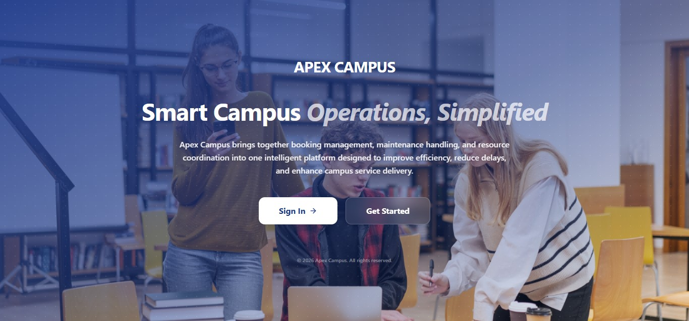
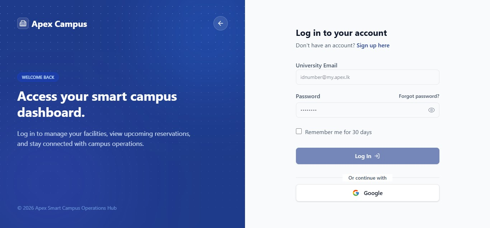
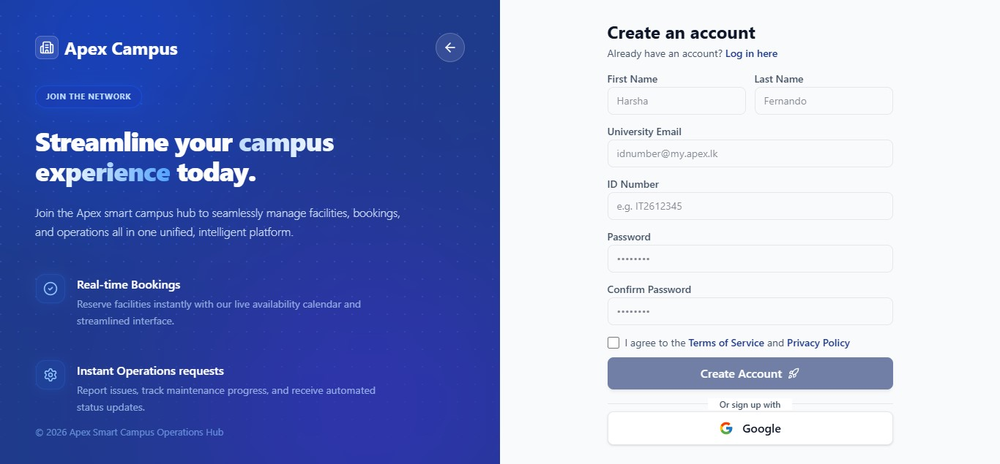
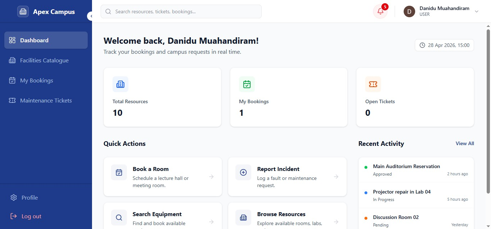
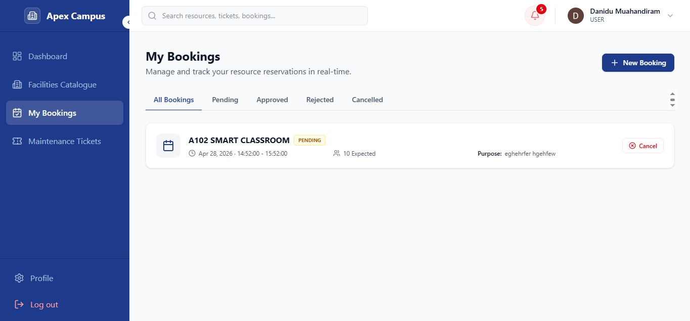
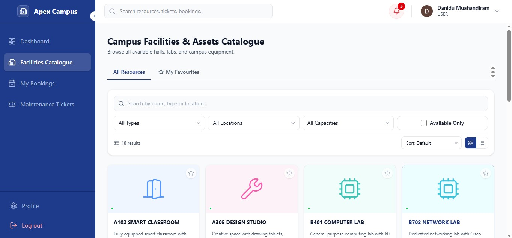
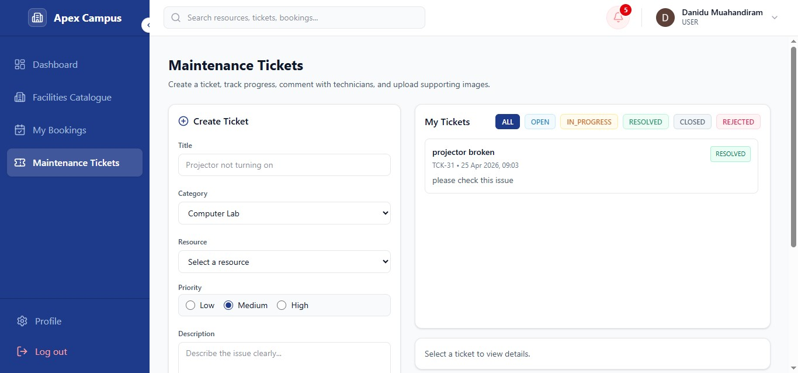
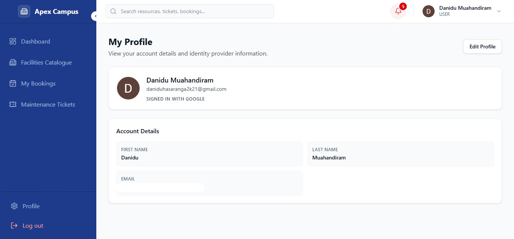
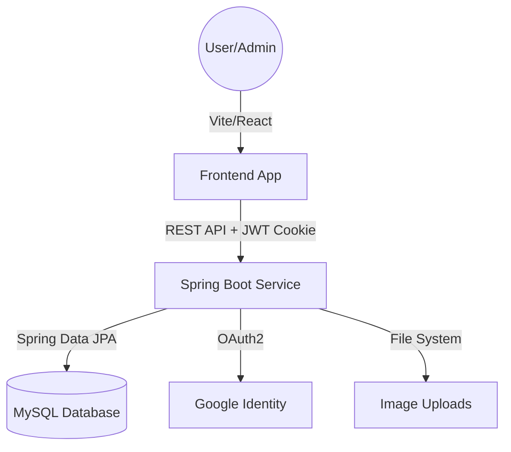

# Apex Campus: Smart Campus Operations Hub


A role-based campus management platform designed to simplify and centralize institutional operations. The system enables efficient handling of facility maintenance, resource booking, and asset management through a structured and user-friendly interface. With secure access control for different user roles, it ensures smooth coordination between users, staff, and administrators. Features like real-time ticket management, organized communication, and reliable data handling help reduce manual effort and improve overall operational efficiency. Built with a modern, scalable architecture, the platform delivers a responsive experience and supports future enhancements.

## 📸 User Interface

### 🏠 Landing Page
<p align="center">
  
</p>

<details>
  <summary>Click here: 🔐 Login & Register Screens</summary>
  <br/>
  <p align="center">
    
    
  </p>
</details>

<details>
  <summary>📊 User Dashboard</summary>
  <br/>
  <p align="center">
    
  </p>
</details>

<details>
  <summary>📅 Booking Management</summary>
  <br/>
  <p align="center">
    
  </p>
</details>

<details>
  <summary>🏢 Facilities & Assets</summary>
  <br/>
  <p align="center">
    
  </p>
</details>

<details>
  <summary>🛠️ Maintenance Tickets</summary>
  <br/>
  <p align="center">
    
  </p>
</details>

<details>
  <summary>👤 User Profile</summary>
  <br/>
  <p align="center">
    
  </p>
</details>

## 🚀 Core Modules

### 🔐 Authentication & Identity
- **Dual Authentication**: Supports both secure local login and **Google OAuth2** integration.
- **JWT-Based Security**: Authentication handled via `HttpOnly` and `SameSite=Lax` cookies to protect against XSS and CSRF attacks.
- **Role-Based Access Control (RBAC)**: Fine-grained authorization for `ADMIN`, `TECHNICIAN`, and `USER` roles.

### 🛠️ Maintenance Ticketing System
- **Complete Lifecycle Management**: Tickets progress through `OPEN`, `IN_PROGRESS`, `RESOLVED`, and `CLOSED/REJECTED` states.
- **Interactive Communication**: Users and technicians can collaborate via comments and attach up to 3 images per ticket.
- **Smart Assignment Workflow**: Admins assign tickets to technician groups, while technicians can claim, manage, and resolve tasks efficiently.

### 📅 Resource Booking Management
- **Centralized Booking System**: Reserve campus resources such as rooms, labs, and equipment.
- **Conflict Prevention**: Prevents double-booking with time-slot validation and availability checks.
- **Approval Workflow**: Booking requests can be approved or rejected by authorized roles.
- **Usage Visibility**: Clear view of current and upcoming reservations.

### 📦 Facility & Asset Management
- **Hierarchical Organization**: Manage buildings, floors, and assets (e.g., projectors, AC units, labs).
- **Real-Time Availability**: Track the status and usability of resources across the campus.

### 🔔 Notification System
- **Event-Driven Alerts**: Notifications for ticket updates, comments, booking actions, and assignments.
- **Unread Tracking**: Persistent notification logs with unread indicators.


## 🛠️ Technology Stack

| Layer | Technologies |
| --- | --- |
| **Backend** | Java 21, Spring Boot 3.4.x, Spring Security (JWT + OAuth2), Hibernate (JPA) |
| **Database** | MySQL 8.x, Flyway (Migration Management) |
| **Frontend** | React 18, Vite, Tailwind CSS, Framer Motion (Animations), Lucide Icons |
| **DevOps** | GitHub Actions (CI), Maven, npm |

---

## 📐 System Architecture



---

## ⚙️ Getting Started

### Prerequisites
- **Java 21** or higher
- **Node.js 18** or higher
- **MySQL 8.x**
- **Maven** 3.9+

### Backend Setup
1. Create a MySQL database named `smartcampus`.
2. Configure your environment variables (or update `application.yml`):
   ```env
   DB_URL=jdbc:mysql://localhost:3306/smartcampus
   DB_USERNAME=your_username
   DB_PASSWORD=your_password
   JWT_SECRET=your_long_secure_random_string
   GOOGLE_CLIENT_ID=your_id
   GOOGLE_CLIENT_SECRET=your_secret
   ```
3. Run migrations and start the server:
   ```bash
   cd backend
   ./mvnw spring-boot:run
   ```
   *The API will be available at `http://localhost:8085`.*

### Frontend Setup
1. Install dependencies:
   ```bash
   cd frontend
   npm install
   ```
2. Start the development server:
   ```bash
   npm run dev
   ```
   *The UI will be available at `http://localhost:5173`.*

---


### Maintenance Workflow
- **Submit**: Describe the issue, pick a resource, and upload photos.
- **Track**: Real-time status updates via the sidebar.
- **Collaborate**: Comment directly with the assigned technician.

---

## 📄 License
This project is part of the **IT3030 - PAF 2026** coursework. All rights reserved.
