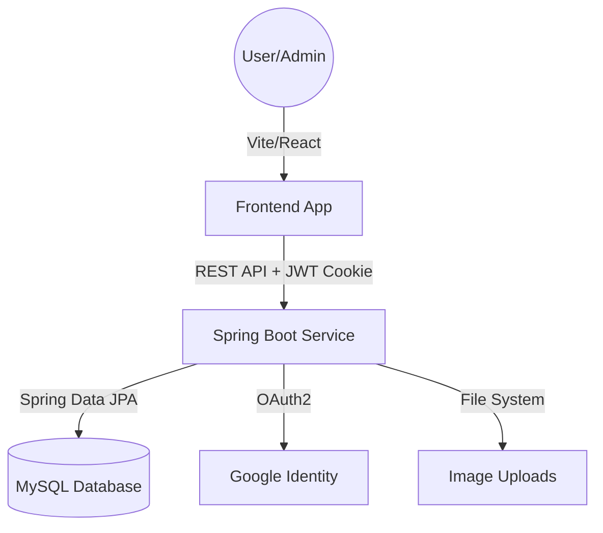

# Apex Campus: Smart Campus Operations Hub


A comprehensive, role-based management platform designed to streamline campus operations, facility maintenance, and resource bookings for modern educational institutions.

---

## 🚀 Core Modules

### 🔐 Authentication & Identity
- **Dual Login System**: Support for both local credentials and **Google OAuth2** integration.
- **JWT Security**: State-of-the-art authentication using `HttpOnly` and `SameSite=Lax` cookies to prevent XSS and CSRF.
- **Role-Based Access Control (RBAC)**: Fine-grained permissions for `ADMIN`, `TECHNICIAN`, and `USER` roles.

### 🛠️ Maintenance Tickets
- **Full Lifecycle**: Tickets transition through `OPEN`, `IN_PROGRESS`, `RESOLVED`, and `CLOSED/REJECTED` states.
- **Rich Interaction**: Users and technicians can exchange comments and upload up to 3 high-quality images per ticket.
- **Smart Assignment**: Admins can assign tickets to technician pools, with technicians able to claim and resolve tasks.

### 📦 Facility & Asset Management
- **Hierarchical Tracking**: Manage university locations (Buildings/Floors) and the specific assets (Projectors, ACs, Labs) within them.
- **Availability Tracking**: Real-time status visibility for all campus resources.

### 🔔 Notification System
- **Contextual Alerts**: Automatic notifications for ticket status changes, new comments, and administrative assignments.
- **Unread Tracking**: Persistent unread counts and historical logs for each user.

---

## 🛠️ Technology Stack

| Layer | Technologies |
| --- | --- |
| **Backend** | Java 21, Spring Boot 3.4.x, Spring Security (JWT + OAuth2), Hibernate (JPA) |
| **Database** | MySQL 8.x, Flyway (Migration Management) |
| **Frontend** | React 18, Vite, Tailwind CSS, Framer Motion (Animations), Lucide Icons |
| **DevOps** | GitHub Actions (CI), Maven, npm |

---

## 📐 System Architecture



---

## ⚙️ Getting Started

### Prerequisites
- **Java 21** or higher
- **Node.js 18** or higher
- **MySQL 8.x**
- **Maven** 3.9+

### Backend Setup
1. Create a MySQL database named `smartcampus`.
2. Configure your environment variables (or update `application.yml`):
   ```env
   DB_URL=jdbc:mysql://localhost:3306/smartcampus
   DB_USERNAME=your_username
   DB_PASSWORD=your_password
   JWT_SECRET=your_long_secure_random_string
   GOOGLE_CLIENT_ID=your_id
   GOOGLE_CLIENT_SECRET=your_secret
   ```
3. Run migrations and start the server:
   ```bash
   cd backend
   ./mvnw spring-boot:run
   ```
   *The API will be available at `http://localhost:8085`.*

### Frontend Setup
1. Install dependencies:
   ```bash
   cd frontend
   npm install
   ```
2. Start the development server:
   ```bash
   npm run dev
   ```
   *The UI will be available at `http://localhost:5173`.*

---

## 📸 User Interface

### Dashboard Preview


### Maintenance Workflow
- **Submit**: Describe the issue, pick a resource, and upload photos.
- **Track**: Real-time status updates via the sidebar.
- **Collaborate**: Comment directly with the assigned technician.

---

## 📄 License
This project is part of the **IT3030 - PAF 2026** coursework. All rights reserved.
